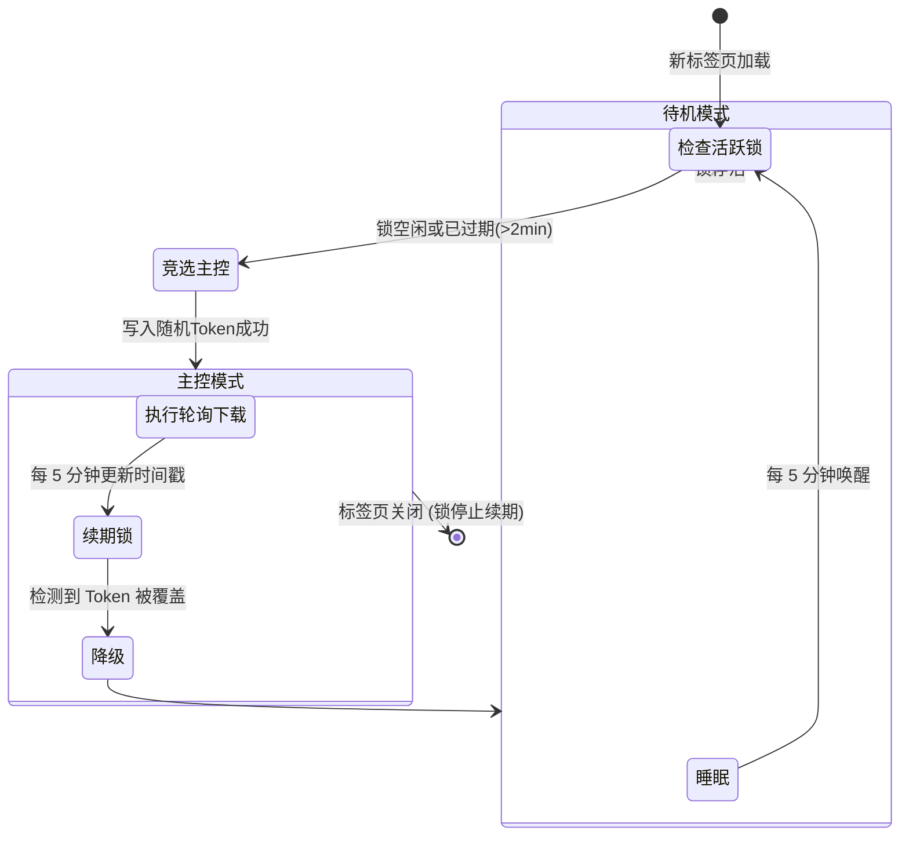
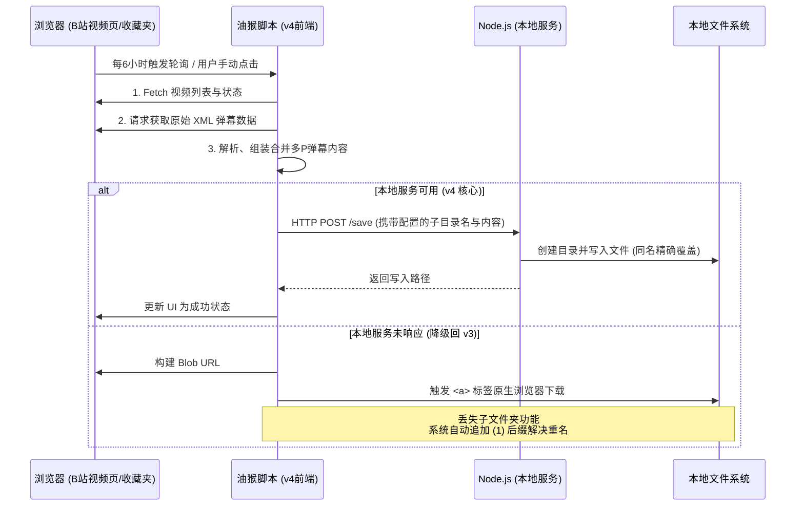

# Bilibili 弹幕下载器

下载 B 站视频弹幕的工具，支持命令行和浏览器油猴脚本两种使用方式。

## 版本说明

| 版本 | 文件 | 说明 |
|:---|:---|:---|
| v1 基础版 | `src/get-danmaku.js` | 命令行工具，适用于单 P 视频 |
| v2 进阶版 | `src/get-danmaku-v2.js` | 命令行工具，支持多 P + 合并下载 |
| v3 油猴版 | `src/get-danmaku-v3.user.js` | 浏览器油猴脚本，下载至浏览器默认下载目录 |
| **v4 本地服务版** | `src/get-danmaku-v4.user.js` + `danmaku-server.mjs` | 油猴脚本 + Node.js 本地服务，支持自定义目录、子文件夹、同名覆盖 |

---

## 📖 项目背景

本项目最初是一个简单的 Node.js 命令行脚本（v1/v2），旨在方便用户快捷地将 B 站弹幕下载为 XML 格式留存。
随着使用场景的扩展，为了实现“后台自动挂机收集”，项目演进出了基于 Tampermonkey 的油猴脚本版本（v3）。用户只需配置一个收藏夹 ID 并在浏览器中挂起含有 B 站的标签页，脚本就会每 6 小时静默轮询更新收藏夹内的所有视频弹幕。

在此过程中，为了突破现代浏览器（尤其是 Chrome）的极致安全沙盒限制，进而衍生出了终极形态的 v4 客户端/服务端架构。

## 🧠 核心工作原理与演进上下文

为了方便后续的 AI 对话或二次开发理解本项目中的历史折腾过程与设计决策，在此记录核心的工程原理与填坑上下文：

### 1. 多标签页竞选与防重复机制（v3/v4 共用）
由于用户可能会平时同时打开几十个 B 站的视频页，如果每个标签页底层都跑一遍 6 小时的定时器去下载弹幕，不仅会被 B 站接口风控，下载文件也会产生数十份。
**解决思路**：引入 **Lease-based 租约锁体系**。



- **选主（Election）**：每个加载了脚本的标签页启动时，先检查 `ACTIVE_TAB_TS`（活跃锁的时间戳）。如果发现锁已经过期（例如 2 分钟未更新），当前标签页就会将自己的随机 Token 写入 `ACTIVE_TAB_TOKEN`，竞选成为**"主控"**。
- **续期与监控**：主控标签页每隔 5 分钟向锁写入当前时间戳以"续命"；其他的**"待机"**标签页同样每 5 分钟醒来一次，只做一件事：检查前任主控是否已死（比如被用户关了）。如果在就会发起新一轮抢占接管后续的轮询任务。
- 效果：无论开多少标签页，后台绝对只有一个定时下载任务在运转。

### 2. 浏览器的下载安全机制痛点（v3 的妥协）
在处理自动轮询下载大量 XML 记录时，用户期待做到两点：**自动建子文件夹归档**，以及**名字相同时自动覆盖（避免出现大量 `.xml(1)`）**。
在纯纯纯前端环境下：
- 如果想要建子文件夹或者覆盖，我们必须用 Tampermonkey 的 `GM_download` 接口，同时构造 `data:` 或 `blob:` URL。
- **坑点**：Chrome 对于扩展主动发起的非 HTTP 地址文件下载有着极其苛刻的安全限制。一旦发现是 `blob:` 数据流，它会**直接无视你传入的 filename**，强行在浏览器根下载目录生成一个无后缀形式的内部 UUID 字符串文件（如 `6451ffc5...`）。
- **v3 的最终妥协**：放弃花里胡哨，老老实实用原生的 `<a download="正确的文件名">` 触发下载。结果就是：文件名 100% 正确，但全挤在默认下载文件夹里，且不可避免由于重名产生 `(1)` 后缀。

### 3. v4 本地服务端架构（降维打击）
为了彻底解决纯前端的文件读写限制，我们用 Node.js 补齐了最后一块拼图：`danmaku-server.mjs`。



- **架构剥离**：把写入磁盘的步骤抽离出浏览器，转而让油猴脚本组装好 XML 内容后，`POST` 给在本地运行的轻量级 HTTP 服务 (`127.0.0.1:18888`)。
- **权限降维**：Node.js 拥有系统的底层读写权限，从而轻易实现了自定义根目录设定、以轮询时间组建子文件夹（如 `Danmaku/2026-03-14_21-15/`）、同时在 Node 层轻松实现无痕同名覆盖。这是在不需要开发完整 Chrome Extension 前提下的收益最高、最完美的实现方案。

---

## 命令行版（v1 / v2）

**环境要求**: Node.js >= 14.0

```bash
# v1：单 P 视频
node src/get-danmaku.js BV1xx411c7mD

# v2：多 P 分集下载（默认）
node src/get-danmaku-v2.js BV1xx411c7mD

# v2：多 P 合并下载
node src/get-danmaku-v2.js BV1xx411c7mD --merge
```

---

## 油猴脚本版（v3）

在浏览器中直接使用，文件下载至浏览器默认下载目录。

**安装步骤：**
1. 安装 [Tampermonkey](https://www.tampermonkey.net/) 浏览器扩展
2. 在 Tampermonkey 中新建脚本，粘贴 `src/get-danmaku-v3.user.js` 内容
3. 打开任意 B 站页面，右下角出现粉色悬浮按钮，点击打开下载面板

**功能：**
- 🎯 手动下载当前视频弹幕（逐 P 或合并）
- 📂 收藏夹自动轮询（每 6 小时自动下载收藏夹内所有视频弹幕）
- 📋 下载日志（最多 500 条）
- 🔧 多标签页调度锁（同一时刻只有一个标签页作为主控）

**多标签页防重复机制：**
- **调度锁（Lease-based）**：主控标签页每 5 分钟续期时间戳，后续加载的标签页检测到 2 分钟内有有效续期则放弃竞争
- **轮询互斥锁**：通过 `GM_setValue` 的 `POLL_RUNNING` 键做全局互斥，防止并发执行轮询

> ⚠️ 自动轮询需至少保持一个 B 站标签页打开。每次轮询结束后会下载一个 `轮询日志_年-月-日_时-分.txt` 文件至下载目录。

---

## 本地服务版（v4）推荐

v4 在 v3 基础上增加了 Node.js 本地服务（`danmaku-server.mjs`），解除浏览器下载限制，支持：
- ✅ 自定义保存目录（不依赖浏览器下载文件夹）
- ✅ 每次轮询自动创建时间戳子文件夹（`弹幕根目录/2026-03-14_21-15/`）
- ✅ 同名文件直接覆盖（不产生 `(1)` 等后缀）
- ✅ 服务不可用时自动降级为浏览器内置下载

### 第一步：配置保存目录

编辑 `danmaku-server.mjs`，修改以下变量：

```javascript
const PORT = 18888;      // 本地监听端口，一般无需修改
const BASE_DIR = process.env.DANMAKU_DIR
    || 'F:\\下载\\Chrome\\弹幕';  // ← 修改为你的保存目录
```

也可通过环境变量临时覆盖（优先级更高）：

```powershell
$env:DANMAKU_DIR = "D:\Danmaku" ; node danmaku-server.mjs
```

### 第二步：安装油猴脚本

在 Tampermonkey 中新建脚本，粘贴 `src/get-danmaku-v4.user.js` 内容并保存。

> ⚠️ v3 和 v4 **不要同时启用**，否则会触发重复轮询。

### 第三步：启动服务（手动）

```powershell
node danmaku-server.mjs
```

启动成功后控制台输出：
```
╔════════════════════════════════════════╗
║   Bilibili 弹幕下载服务 已启动          ║
╠════════════════════════════════════════╣
║  端口:  http://127.0.0.1:18888         ║
║  目录:  F:\下载\Chrome\弹幕             ║
╚════════════════════════════════════════╝
```

打开 B 站后，面板诊断栏会显示 **🟢 本地服务已连接**。

### 第四步：设置开机自启（PM2）

```powershell
# 全局安装 PM2（只需一次）
npm install -g pm2 pm2-windows-startup

# 注册 Windows 开机启动项（只需一次）
pm2-startup install

# 将服务交由 PM2 管理并启动
pm2 start danmaku-server.mjs --name danmaku-server

# 保存当前进程列表，下次开机自动恢复
pm2 save
```

### PM2 日常管理命令

```powershell
pm2 status                      # 查看所有进程的运行状态
pm2 logs danmaku-server         # 实时查看服务日志（Ctrl+C 退出）
pm2 logs danmaku-server --lines 50  # 查看最近 50 条日志

pm2 restart danmaku-server      # 重启（修改 danmaku-server.mjs 后执行）
pm2 stop danmaku-server         # 临时停止（不删除进程）
pm2 start danmaku-server        # 重新启动已停止的进程

pm2 delete danmaku-server       # 从 PM2 中彻底移除该进程
pm2 save                        # 保存当前进程列表（delete 后需再次 save 才能生效）

pm2-startup uninstall           # 取消 Windows 开机自启注册
```

### 可配置变量

| 位置 | 变量 | 默认值 | 说明 |
|:---|:---|:---|:---|
| `danmaku-server.mjs` | `PORT` | `18888` | 本地监听端口，如与其他服务冲突可更改。修改后需同步修改 v4 脚本中的 `SERVER_URL` |
| `danmaku-server.mjs` | `BASE_DIR` | — | 弹幕文件保存根目录，直接在代码中修改或通过 `$env:DANMAKU_DIR` 环境变量覆盖 |
| `get-danmaku-v4.user.js` | `SERVER_URL` | `http://127.0.0.1:18888` | 本地服务地址，只有修改了 `PORT` 时才需要同步修改 |
| `get-danmaku-v4.user.js` | `POLL_INTERVAL_MS` | `6 * 60 * 60 * 1000`（6小时） | 自动轮询间隔，单位毫秒 |

---

## 输出文件结构

**v3（浏览器下载目录）：**
```
Downloads/
├── 视频标题_[全集合并]_BV1xxx.xml
└── 轮询日志_2026-03-14_21-15.txt
```

**v4（本地服务，含子文件夹）：**
```
BASE_DIR/
└── 2026-03-14_21-15/         ← 每次轮询自动创建
    ├── 视频标题A_[全集合并]_BV1xxx.xml
    ├── 视频标题B_[全集合并]_BV1yyy.xml
    └── 轮询日志_2026-03-14_21-15.txt
```

**文件命名规则：**
- 命令行分 P：`视频标题_P1_分集名_BV号.xml`
- 命令行 / 油猴合并：`视频标题_[全集合并]_BV号.xml`

---

## License

MIT
