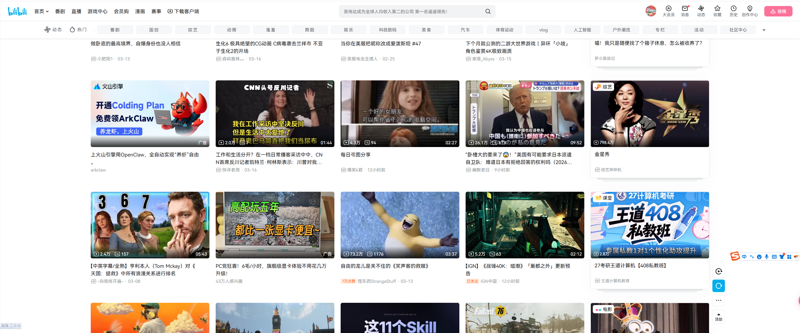
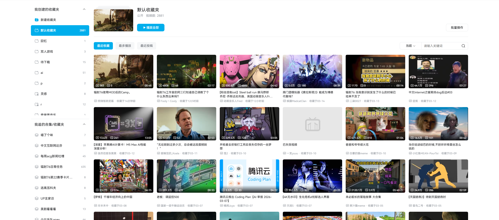
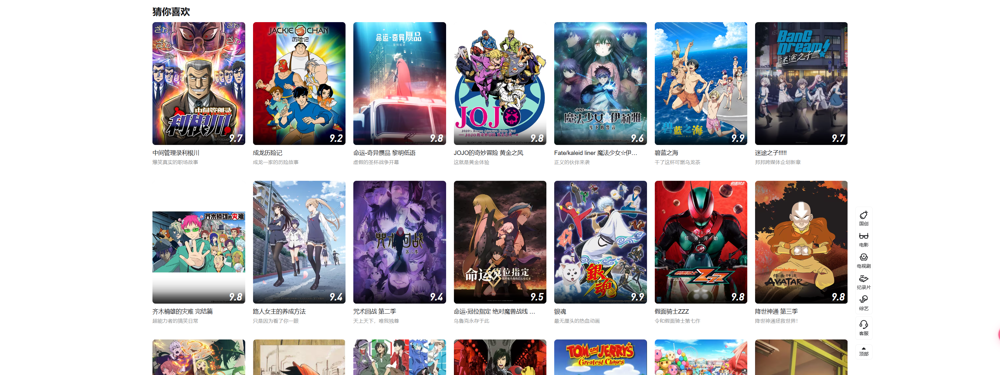

#   TODO
1. 下载弹幕的同时下载对应视频，但对应视频不用更新，只会下载一遍，视频和弹幕放在同一个文件夹下
2. 同时获取对应视频的相关信息，如封面、标题、up主，是否已经下架，最后弹幕更新时间等
3. 创建一个本地能随时访问的webUI,把已经下载的视频和弹幕的信息展示出来，包括视频的封面、标题、up主，是否已经下架，最后弹幕更新时间等，样式可以参考哔哩哔哩网站的视频流卡片。当然也只是参考，因为我们要展示的信息和它的不一样。下面我给出几个不同的参考图片。你也可以根据我的需求自行发挥，美观且能把数据清晰展示即可。

4. 当我点击webUI中某个显示的视频后，会播放该视频，同时播放该视频的弹幕。我目前不确定这个效果能不能实现，你可以先进行方案调研，实在不行我能接受的兜底的方式是，点击视频后打开该视频在本地所属的文件夹。
5. 中间开发调试webUI的时候可以使用chrome-devtools这个MCP
6. 要求开发过程中不要影响目前已有的v4服务的正常运作