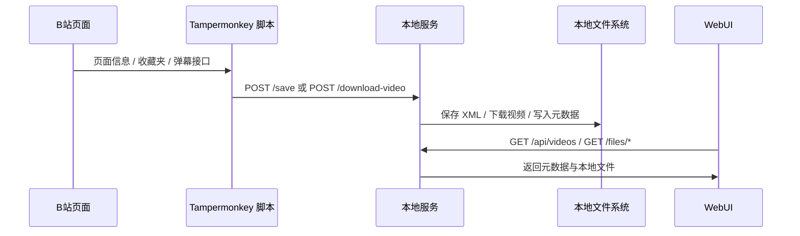

# 架构与关键设计

## 总体结构

项目当前主线是 `v4` 的“浏览器脚本 + 本地服务”架构。

## 为什么会从 v3 演进到 v4

纯前端的 Tampermonkey 脚本可以拿到页面上下文和接口数据，但浏览器下载沙盒对以下能力支持很差：

- 指定稳定的子文件夹
- 同名覆盖
- 可靠地写入本地库结构
- 把视频、弹幕、元数据统一归档

所以 v4 把“读网页”和“写磁盘”拆开：

- 油猴脚本继续在浏览器里工作
- Node.js 本地服务负责磁盘与视频下载

## 多标签页防重复

v3 / v4 共用一套租约锁模型，目标是保证同一时刻只有一个标签页负责轮询。

核心键值：

- `ACTIVE_TAB_TOKEN`
- `ACTIVE_TAB_TS`
- `POLL_RUNNING`

策略：

- 标签页启动后尝试竞争“主控”
- 主控每 5 分钟续期
- 未抢到锁的标签页进入待机，只做心跳检查
- 轮询执行时再用 `POLL_RUNNING` 做一次全局互斥

这套逻辑主要在 `src/get-danmaku-v3.user.js` 和 `src/get-danmaku-v4.user.js` 中。

## v4 关键职责划分

### 油猴脚本

职责：

- 获取视频信息与收藏夹列表
- 拉取并写入分 P 弹幕 XML
- 手动场景下按需组装多 P 合并结果
- 收集浏览器侧 cookie
- 构造分 P 视频下载任务并调用本地服务

关键文件：

- `src/get-danmaku-v4.user.js`

### 本地服务

职责：

- 保存 XML 和轮询日志
- 按 `BV + page` 粒度调 `yt-dlp` 下载视频
- 为每个分 P 写入 `.info.json` 元数据
- 维护失效 / 下架视频的服务端黑名单状态
- 聚合本地视频库并提供 WebUI / 文件访问接口

关键文件：

- `danmaku-server.mjs`

### WebUI

职责：

- 按 BV 聚合展示本地视频卡片
- 提供排序、筛选和外链跳转
- 通过详情弹层查看分 P 列表并播放指定分 P
- 打开视频所在文件夹并尽量选中对应视频文件

关键文件：

- `webui/index.html`
- `webui/app.js`
- `webui/style.css`

## 视频下载与格式选择

服务端下载视频时，流程不是直接写死一个 `yt-dlp -f` 表达式，而是：

1. 先用 `yt-dlp -J` 探测可用格式
2. 对格式分组排序
3. 结合体积预算选择最佳方案
4. 再用选中的 `formatId` 执行真实下载

关键文件：

- `src/video-format-selector.mjs`
- `danmaku-server.mjs`

当前策略：

- 同档优先高帧率
- 同档优先更优编码
- 如果当前最高档超过 `1 GiB`，则逐级降档
- 只在“真超过预算”时降档，不会无脑先压到 1080P

## 元数据模型

本地服务会为已下载视频写入同名 `.info.json`，用于 WebUI 展示和后续判断。

主要字段包括：

- `bvid`
- `title`
- `page`
- `partTitle`
- `groupDir`
- `partCount`
- `hasMultipleParts`
- `cover`
- `uploader`
- `uploaderMid`
- `favoriteTime`
- `publishTime`
- `videoPath`
- `selectedFormat`
- `downloadStatus`
- `actualSize`
- `qualityVerifiedAt`

黑名单状态文件：

- `BASE_DIR/state/download-blacklist.json`

主要字段包括：

- `bvid`
- `title`
- `status`
- `reasonCode`
- `reasonText`
- `hitCount`
- `threshold`
- `firstSeenAt`
- `lastSeenAt`
- `lastSource`
- `lastMessage`
- `favoriteTime`

## 目录归档模型

当前 `v4` 的目录归档分成两条：

- `BASE_DIR/danmaku/<title>_<bvid>/`
  - 保存分 P XML
  - 手动“合并下载”时额外保存 `[全集合并]` XML
- `BASE_DIR/videos/<title>_<bvid>/`
  - 保存每个分 P 的视频文件与同名 `.info.json`
- `BASE_DIR/state/download-blacklist.json`
  - 保存失效 / 下架视频的累计命中与黑名单状态

轮询日志单独放在：

- `BASE_DIR/danmaku/logs/轮询日志_<timestamp>.txt`

这样做的目的：

- 轮询时可直接覆盖旧弹幕文件
- 多 P 视频和弹幕保持一一对应
- 失效资源在达到阈值后可稳定跳过，避免重复无效请求
- WebUI 可以按 BV 聚合，再按分 P 展开

## 失效视频自动跳过

当前 `v4` 在收藏夹轮询链路中会显式区分三类情况：

1. 收藏夹接口直接标记为失效 / 下架
2. 收藏夹仍可见，但 `view` 接口明确返回资源不存在或不可访问
3. `yt-dlp` 明确返回 404 / unavailable 类错误

这些命中都会统一上报到本地服务的黑名单状态表：

- 按 `bvid` 维度累计
- 默认阈值为 `5`
- 达到阈值后状态切为 `blacklisted`
- 后续轮询和服务端下载入口都会直接跳过
- WebUI 只展示已进入 `blacklisted` 的条目

## 设计取舍

### 为什么视频下载放在服务端而不是油猴脚本

- 服务端更容易稳定写盘
- 更容易做重复下载判定
- 更容易记录元数据
- 更容易接入 `yt-dlp`

### 为什么保留 v1 / v2 / v3

- v1 / v2 足够轻，适合临时使用
- v3 不依赖本地服务，部署简单
- v4 是当前完整方案，但不应破坏前面版本的可用性

## 维护时的基本原则

- 不影响现有 v4 主链路
- 涉及视频格式逻辑时优先补测试
- 涉及接口或页面能力时同步更新文档
- 涉及安全边界时优先检查 `localhost` 接口暴露面
